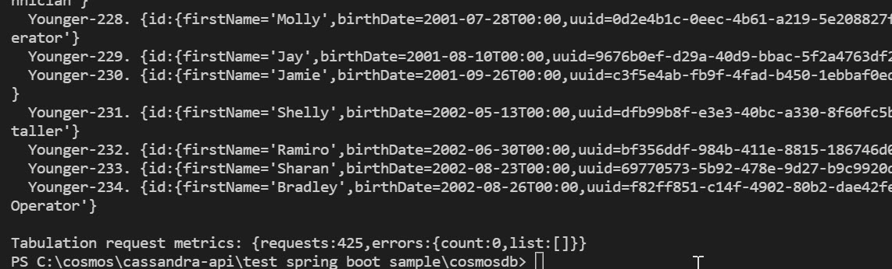

# Spring Data on Azure Cosmos DB Cassandra API (v4 Java Driver)

Azure Cosmos DB is a globally distributed multi-model database. One of the supported APIs is the [Cassandra API](https://docs.microsoft.com/azure/cosmos-db/cassandra-introduction). This sample shows how to use Spring Data for Apache Cassandra with Azure Cosmos DB awareness features. This sample implements a [retry policy](https://github.com/Azure/azure-cosmos-cassandra-extensions/blob/release/java-driver-4/1.0.1/driver-4/src/main/java/com/azure/cosmos/cassandra/CosmosRetryPolicy.java) to handle rate limited requests, also known as [429 errors](https://docs.microsoft.com/rest/api/cosmos-db/http-status-codes-for-cosmosdb) (when consumed throughput exceeds the number of [Request Units](https://docs.microsoft.com/azure/cosmos-db/request-units) provisioned for the service). It also implements a load balancing policy which allows you to specify preferred read or write regions. The sample also unifies spring boot configuration into a single [application.yaml](https://github.com/Azure-Samples/azure-cosmos-cassandra-extensions-java-spring-boot-sample-v4/blob/main/src/main/resources/application.yaml). This feature, along with the retry and load balancing policies, are provided in the [Azure Cosmos DB extension for Cassandra API](https://github.com/Azure/azure-cosmos-cassandra-extensions/tree/release/java-driver-4/1.0.1) for the [Java v4 Datastax Apache Cassandra OSS Driver](https://github.com/datastax/java-driver/tree/4.x). 


## Getting Started

## Prerequisites
* Before you can run this sample, you must have the following prerequisites:
    * An active Azure Cassandra API account - If you don't have an account, refer to the [Create Cassandra API account](https://aka.ms/cassapijavaqs). For illustration purposes, the sample assumes an account with two regions that are very far apart: in this case Australia East and UK South (where UK South is very close to where the client application has been deployed). 
    * [Java Development Kit (JDK) 1.8+](http://www.oracle.com/technetwork/java/javase/downloads/jdk8-downloads-2133151.html)
        * On Ubuntu, run `apt-get install default-jdk` to install the JDK.
    * Be sure to set the JAVA_HOME environment variable to point to the folder where the JDK is installed.
    * [Download](http://maven.apache.org/download.cgi) and [install](http://maven.apache.org/install.html) a [Maven](http://maven.apache.org/) binary archive
        * On Ubuntu, you can run `apt-get install maven` to install Maven.
    * [Git](https://www.git-scm.com/)
        * On Ubuntu, you can run `sudo apt-get install git` to install Git.

## Running this sample
1. Clone this repository using `git clone https://github.com/Azure-Samples/azure-cosmos-cassandra-extensions-java-spring-boot-sample-v4.git cosmosdb`.

1. Next, create the following environment variables and populate as follows:

```conf
    AZURE_COSMOS_CASSANDRA_GLOBAL_ENDPOINT = "Contact point in Azure Portal for the Cosmos DB Account"
    AZURE_COSMOS_CASSANDRA_JAR = "target/azure-cosmos-cassandra-spring-boot-app-example-1.0.1.jar"
    AZURE_COSMOS_CASSANDRA_USERNAME = "Username in Azure Portal for the Cosmos DB Account"
    AZURE_COSMOS_CASSANDRA_PASSWORD = "Primary Password in Azure Portal for the Cosmos DB Account"
```

1. Change directories to the repo using `cd cosmosdb`

1. Run `mvn clean package -DskipTests` from java-examples folder to build the project. This will generate `azure-cosmos-cassandra-spring-boot-app-example-1.0.1.jar` under the target folder.

    Note that `application.conf` under both `main/resources` and `test/resources` directories contain settings that override [reference.conf](https://github.com/Azure/azure-cosmos-cassandra-extensions/blob/release/java-driver-4/0.1.0-beta.1/package/src/main/resources/reference.conf) in the [Azure Cosmos DB extension for Cassandra API](https://github.com/Azure/azure-cosmos-cassandra-extensions/tree/release/java-driver-4/1.0.1), which we are implementing in this sample. 
    
    However, the environment variables you set above are defined within the [application.conf](https://github.com/Azure/azure-cosmos-cassandra-extensions/blob/release/java-driver-4/1.0.1/driver-4/src/test/resources/application.conf) of the extension library. Also note that `reference.conf` defines various default connection settings that we recommend for a good experience using Cassandra API.

1. Run `java -jar target/azure-cosmos-cassandra-spring-boot-app-example-1.0.1.jar` in a terminal to start your java application. 

1. This will create a keyspace called `azure_cosmos_cassandra_driver_4_examples` and a table called `people`, and then run a load test with many concurrent threads in the database. Please inspect the code at `com.azure.cosmos.cassandra.example.ApplicationCommandLineRunner` under the src/main directory to understand how it functions. 
 
    

You should always perform sufficient load testing to ensure that the implementation meets your requirements.

### Packaging and Integration Testing

```bash
mvn clean package integration-test -DargLine="\
'-Dazure.cosmos.cassandra.global-endpoint=<account-name>cassandra.cosmos.azure.com:10350' \
'-Dazure.cosmos.cassandra.username=<username>' \
'-Dazure.cosmos.cassandra.password=<password>' \
'-Dazure.cosmos.cassandra.preferred-regions=<region-name>[,...]' \
'-Dazure.cosmos.cassandra.truststore-path=<truststore-path>'" \
'-Dazure.cosmos.cassandra.truststore-password=<truststore-password>'"
```
